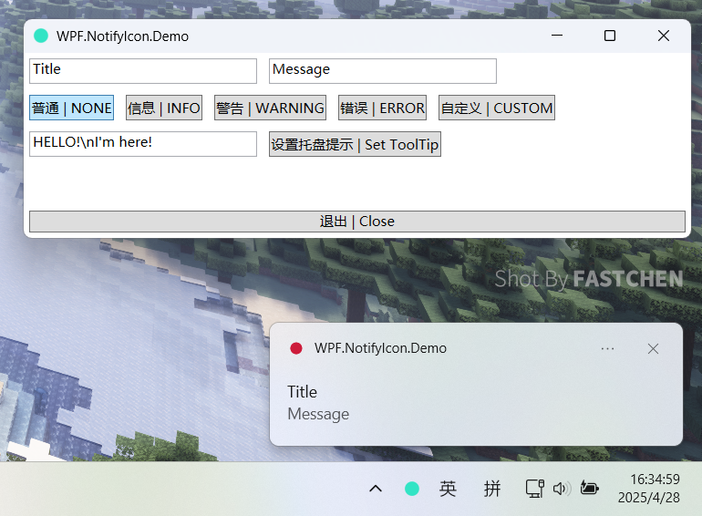
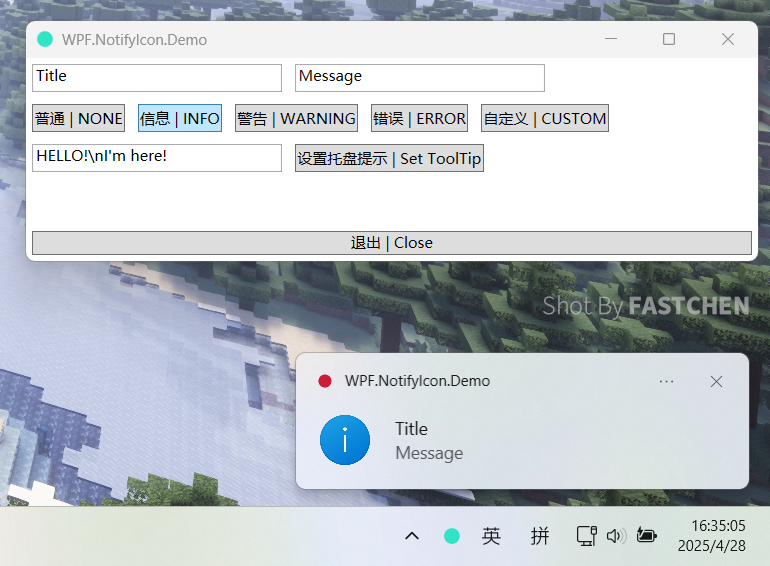
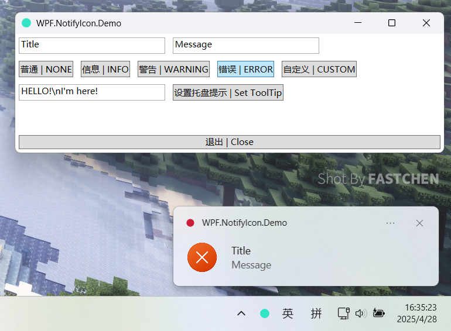
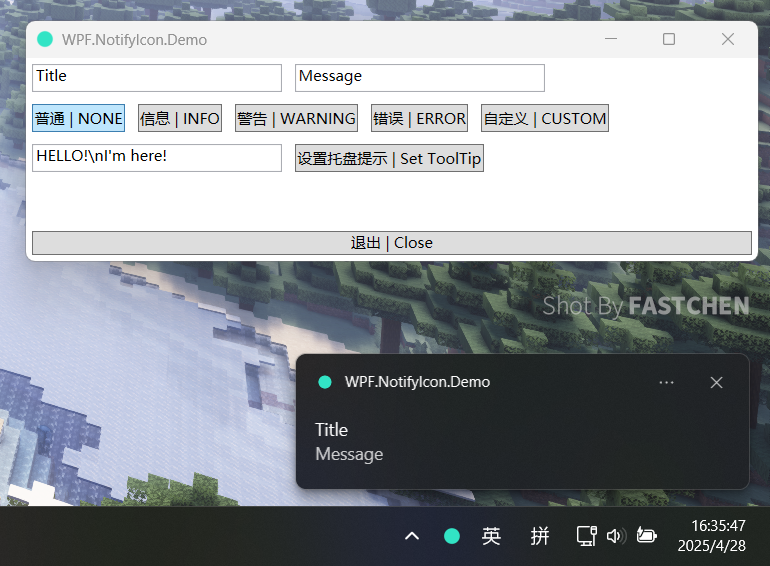
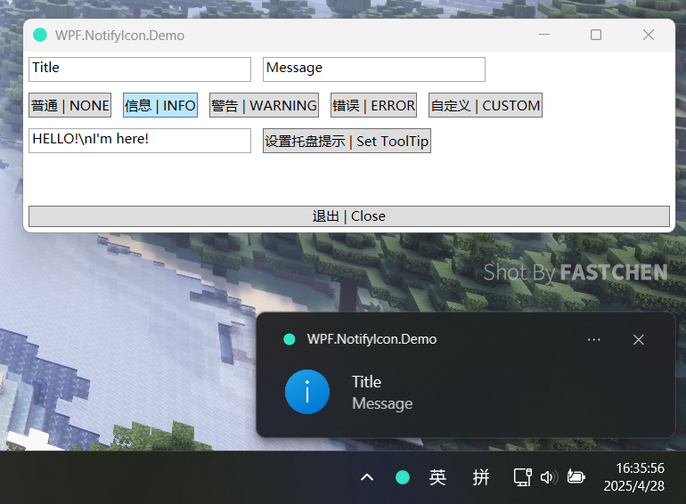
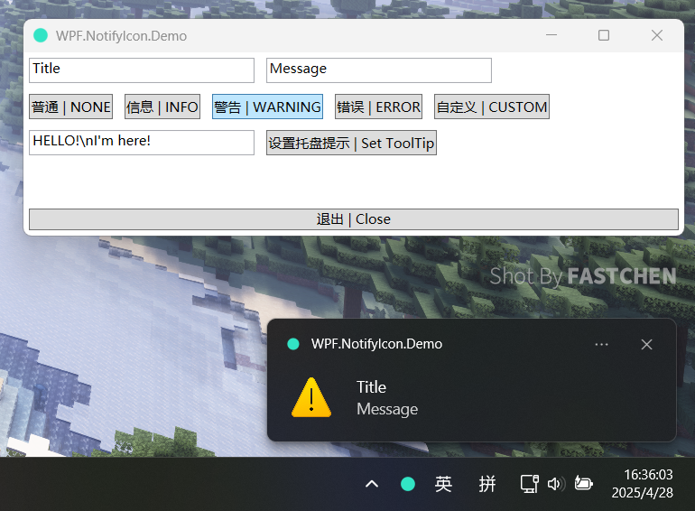
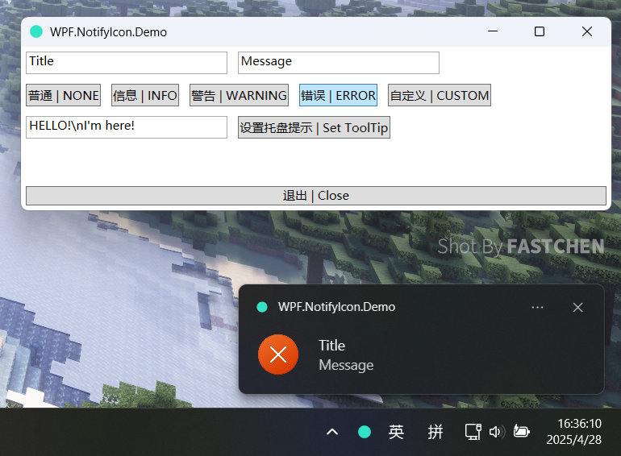
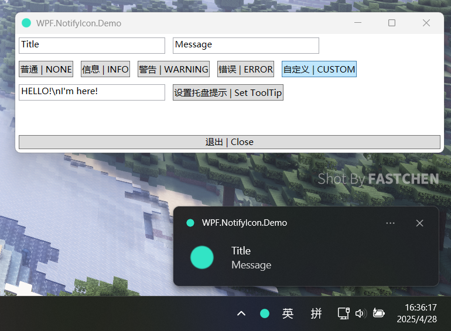

<div align="center">
  
  <h1>WPF.NotifyIcon</h1>
  <h3>WPF 上的原生 NotifyIcon 实现</h3>
  
  <a href="https://github.com/FastChen/WPF.NotifyIcon/issues"></a>
  <h4>中文 / <a href="./README-en_US.md">English</a></h4>
</div>

## 特点

- 仅 10Kb 大小
- 使用 `Shell_NotifyIcon` 原生实现，无需第三方库支持。
- 支持 .NET4.62 Framework 至 .NET9(还可以更低需要自行编译)
- 在 Windows 上弹出气泡通知(Win10以上系统则是 Toast 的普通通知)。
- 与 WinForm NotifyIcon 控件的使用类似(目前在实现完全一致使用方案)。

## 使用

**步骤 1:** 在你的 WPF 项目安装包 `WPF.NotifyIcon`

访问 Nuget 包地址：[WPF.NotifyIcon - Nuget](https://www.nuget.org/packages/WPF.NotifyIcon/)

使用命令行: `Install-Package WPF.NotifyIcon`

使用可视化界面: 


**步骤 2:** 创建一个 NotifyIcon

> [!TIP]
> 有关使用可以查看 `samples\WPF.NotifyIcon.Demo` 示例!


```c#
// 创建一个 NotifyIcon
private NotifyIcon _notifyIcon = new();

public MainWindow()
{
    InitializeComponent();

    // 获取程序自身图标
    var icon = _notifyIcon.GetIconHandleFromFile(Environment.ProcessPath);

    // 创建托盘图标与设置托盘
    _notifyIcon.Create(this, icon, "HELLO!\nI'm here!");

    // 可以绑定左右键触发事件
    _notifyIcon.LeftClick += ShowWindow;
    _notifyIcon.RightClick += ShowContextMenu;

    // 弹出 ShowBalloonTip
    _notifyIcon.ShowBalloonTip(5000, "Hello!", "WPF.NotifyIcon!", ToolTipIcon.None);

    // 设置 ToolTip 内容
    _notifyIcon.SetToolTip("Wow!");

    // 可通过 Icon 属性设置/获取图标
    _notifyIcon.Icon = IntPtr.Zero;
}
```

其中 `ToolTipIcon` 支持以下的图标:

```c#
public enum ToolTipIcon
{
    /// <summary>
    /// 不显示图标
    /// </summary>
    None = 0,

    /// <summary>
    /// 信息图标
    /// </summary>
    Info = 1,

    /// <summary>
    /// 警告图标
    /// </summary>
    Warning = 2,

    /// <summary>
    /// 错误图标
    /// </summary>
    Error = 3,

    /// <summary>
    /// 创建时使用应用程序图标
    /// </summary>
    Custom = 4,
}
```

## 一些图片

### Demo App


### ToolTip:


### TrayMenu:


### BalloonTip:

**Light:**







**Dark:**





